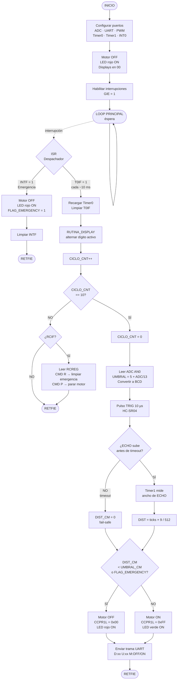

```mermaid
flowchart TD
    INICIO([INICIO]) --> INIT[Configurar puertos\nADC · UART · PWM\nTimer0 · Timer1 · INT0]
    INIT --> SAFE[Motor OFF\nLED rojo ON\nDisplays en 00]
    SAFE --> GIE[Habilitar interrupciones\nGIE = 1]
    GIE --> LOOP([LOOP PRINCIPAL\néspera])
    LOOP --> LOOP

    %% ─── ISR ───
    LOOP -.->|interrupción| ISR{ISR\nDespachador}

    ISR -->|INTF = 1\nEmergencia| IEMG[Motor OFF\nLED rojo ON\nFLAG_EMERGENCY = 1]
    IEMG --> BCF_INTF[Limpiar INTF]
    BCF_INTF --> RET1([RETFIE])

    ISR -->|T0IF = 1\ncada ~10 ms| RELOAD[Recargar Timer0\nLimpiar T0IF]
    RELOAD --> DISP[RUTINA_DISPLAY\nalternar dígito activo]
    DISP --> INC[CICLO_CNT++]
    INC --> CNT{CICLO_CNT\n== 10?}

    CNT -->|NO| RX{¿RCIF?}
    RX -->|SÍ| UART_RX[Leer RCREG\nCMD R → limpiar emergencia\nCMD P → parar motor]
    RX -->|NO| RET2([RETFIE])
    UART_RX --> RET2

    CNT -->|SÍ| RST[CICLO_CNT = 0]
    RST --> ADC[Leer ADC AN0\nUMBRAL = 5 + ADC/13\nConvertir a BCD]
    ADC --> TRIG[Pulso TRIG 10 µs\nHC-SR04]
    TRIG --> ECHO{¿ECHO sube\nantes de timeout?}
    ECHO -->|NO\ntimeout| ZERO[DIST_CM = 0\nfail-safe]
    ECHO -->|SÍ| TMR1[Timer1 mide\nancho de ECHO]
    TMR1 --> CALC[DIST = ticks × 9 / 512]
    ZERO --> CMP
    CALC --> CMP{DIST_CM\n< UMBRAL_CM\no FLAG_EMERGENCY?}
    CMP -->|SÍ| MOFF[Motor OFF\nCCPR1L = 0x00\nLED rojo ON]
    CMP -->|NO| MON[Motor ON\nCCPR1L = 0xFF\nLED verde ON]
    MOFF --> TX[Enviar trama UART\nD:xx U:xx M:OFF/ON]
    MON --> TX
    TX --> RET3([RETFIE])
```