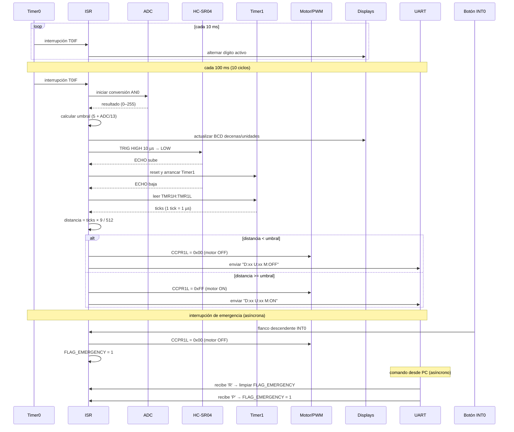

```mermaid
sequenceDiagram
    participant T0 as Timer0
    participant ISR as ISR
    participant ADC
    participant SR04 as HC-SR04
    participant T1 as Timer1
    participant MOT as Motor/PWM
    participant DISP as Displays
    participant UART

    loop cada 10 ms
        T0->>ISR: interrupción T0IF
        ISR->>DISP: alternar dígito activo
    end

    note over T0,UART: cada 100 ms (10 ciclos)

    T0->>ISR: interrupción T0IF
    ISR->>ADC: iniciar conversión AN0
    ADC-->>ISR: resultado (0–255)
    ISR->>ISR: calcular umbral (5 + ADC/13)
    ISR->>DISP: actualizar BCD decenas/unidades

    ISR->>SR04: TRIG HIGH 10 µs → LOW
    SR04-->>ISR: ECHO sube
    ISR->>T1: reset y arrancar Timer1
    SR04-->>ISR: ECHO baja
    ISR->>T1: leer TMR1H:TMR1L
    T1-->>ISR: ticks (1 tick = 1 µs)
    ISR->>ISR: distancia = ticks × 9 / 512

    alt distancia < umbral
        ISR->>MOT: CCPR1L = 0x00 (motor OFF)
        ISR->>UART: enviar "D:xx U:xx M:OFF"
    else distancia >= umbral
        ISR->>MOT: CCPR1L = 0xFF (motor ON)
        ISR->>UART: enviar "D:xx U:xx M:ON"
    end

    note over T0,UART: interrupción de emergencia (asíncrona)

    participant BTN as Botón INT0
    BTN->>ISR: flanco descendente INT0
    ISR->>MOT: CCPR1L = 0x00 (motor OFF)
    ISR->>ISR: FLAG_EMERGENCY = 1

    note over UART: comando desde PC (asíncrono)
    UART->>ISR: recibe 'R' → limpiar FLAG_EMERGENCY
    UART->>ISR: recibe 'P' → FLAG_EMERGENCY = 1
```
