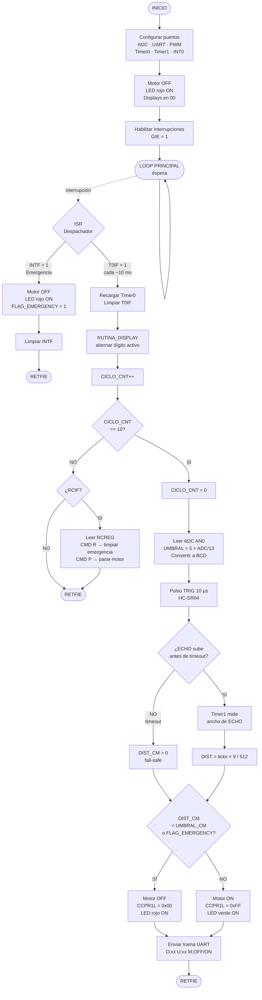
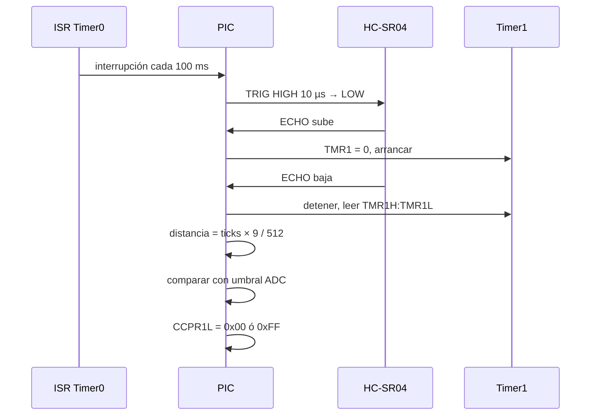

# Sierra Segura — PIC16F887
Electrónica Digital II - Universidad Nacional de Córdoba 
- Integrantes: Piren Amancay Rios Painefil / Juan Cruz Sanchez Oliveto / Ariana Agostina Sureda
- Profesor: Marcos Blasco

---
## 1. Descripción general del proyecto

El sistema mide continuamente la distancia entre la mano del operario y la hoja de sierra usando un HC-SR04. Si la distancia detectada es menor que un umbral de seguridad configurable, el sistema detiene automáticamente el motor para reducir el riesgo de accidentes.Además, dispone de un botón de emergencia que permite detener el motor de forma inmediata.Este proyecto busca aumentar la seguridad durante la operación de máquinas con elementos de corte. Está orientado al desarrollo de prototipos que requieran implementar sistemas básicos de seguridad y control utilizando microcontroladores.

### Alcances del proyecto

El sistema es capaz de:
- Medir la distancia entre la mano del operario y la zona de corte.
- Permitir la configuración de un umbral de seguridad utilizando un potenciómetro.
- Visualizar el valor del umbral configurado en dos displays de 7 segmentos.
- Detener el motor de forma inmediata mediante un boton.
- Comunicar el estado del sistema a una PC a través de UART.

El sistema no incluye:
- Control de una sierra industrial real.
- Registro histórico de eventos.

### Posibles etapas siguientes 
- Incluir un sistema de alarmas sonoras previas a la detención del motor para mejorar la seguridad del operario.
- Implementar rampas de aceleración y desaceleración del motor para evitar arranques bruscos.
- Mejorar UART enviando mensajes estructurados.

---
## 2. Arquitectura del sistema: Hardware y Software

### Hardware & Interconexión


### Arquitectura de software


---
## 3. Especificaciones eléctricas, alimentación y entorno

### Parámetros de alimentación y consumo 
- Tensión de operación del sistema: 5 V.
- Método de alimentación: Fuente de alimentación de 5 V.
- Consumo estimado en modo activo: Aprox. de 200 a 250 mA

### Entorno
- Herramientas de software: MPLAB X IDE y ensamblador MPASM.
- Método de programación: UART.
- Configuración de bits: 
   * PWRTE: ON
   * MCLRE: ON
   * BOREN: ON
   * WDT: OFF
   * FOSC HS (oscilador ext): 
   
- Periféricos internos utilizados: ADC / CCP1 / TIMER0 / TIMER1 / TIMER2 / EUSART / PWM
- Gestión de interrupciones: El sistema utiliza el único vector de interrupción disponible en el PIC16F887. La interrupción externa INT0 asociada al botón de emergencia tiene prioridad, ya que representa la condición más crítica del sistema. Ante su activación, el motor se detiene inmediatamente para garantizar la seguridad del operario.

---
## 4. Proceso de integración y desarrollo 

- Etapa 1 (validacion inicial): Se realizó la verificación de los puertos del microcontrolador que se iban a utilizar en el proyecto y se configuraron.Posteriormente, se efectuó la prueba del sensor ultrasónico HC-SR04 para verificar su correcto funcionamiento
- Etapa 2 (adquisición/comunicación): Se implementó la lectura del sensor ultrasónico HC-SR04 para obtener la distancia medida y la lectura del ADC para adquirir el valor del potenciómetro utilizado como umbral de seguridad.
-Etapa 3 (integracion logica): Se desarrolló la lógica principal del sistema, comparando la distancia medida por el sensor ultrasónico HC-SR04 con el umbral de seguridad configurado mediante el potenciómetro.Además se incorporó la interrupción externa correspondiente al botón de emergencia.
- Etapa 4 (sistema completo): Se integraron todos los módulos desarrollados previamente, verificando el funcionamiento conjunto. También se realizó la simulación completa del sistema en Proteus para validar su comportamiento antes de la implementación final.


---
## 5. Ensayos, pruebas y resultados 
### Testeo del funcionamiento del sensor 


---
## 6. Estructura del repositorio

| Componente | Cantidad | Notas |
|------------|----------|-------|
| PIC16F887 | 1 | DIP-40 |
| Cristal 4 MHz | 1 | + capacitores 22 pF |
| HC-SR04 | 1 | Sensor ultrasónico |
| Potenciómetro 10 kΩ | 1 | Ajuste de umbral |
| Motor DC 5V | 1 | Simulación de sierra |
| Transistor TIP31C (o TIP120) | 1 | Driver PWM del motor |
| Diodo 1N4007 | 1 | Flyback del motor |
| Resistencia 1 kΩ | 1 | Base del transistor driver |
| Transistor BC547 | 2 | Selectores displays |
| Display 7 segmentos cátodo común | 2 | Dígito decenas y unidades |
| Resistencias 330 Ω | 7 | Una por segmento |
| Resistencias 1 kΩ | 2 | Base transistores selectores |
| LED verde | 1 | Estado operación |
| LED rojo | 1 | Estado alarma/emergencia |
| Resistencias 470 Ω | 2 | LEDs |
| Pulsador NO | 1 | Botón emergencia |
| Adaptador USB-TTL | 1 | Comunicación serie con PC |

---
## Asignación de pines

| Pin | Dir | Función |
|-----|-----|---------|
| RA0/AN0 | IN | Potenciómetro (ADC) |
| RA1 | OUT | LED verde |
| RA2 | OUT | LED rojo |
| RB0/INT0 | IN | Botón emergencia |
| RC0 | OUT | TRIG HC-SR04 |
| RC1 | IN | ECHO HC-SR04 |
| RC2/CCP1 | OUT | PWM → base transistor motor |
| RC6/TX | OUT | UART → PC |
| RC7/RX | IN | UART ← PC |
| RD0–RD6 | OUT | Segmentos a–g (bus compartido) |
| RE0 | OUT | Selector dígito decenas |
| RE1 | OUT | Selector dígito unidades |

---
## Diagrama de conexión

flowchart TD

A[Inicio] --> B[Configurar ADC UART PWM Timer1 Timer0 Puertos]

B --> C[Loop Infinito]

C --> D{Interrupcion}

D -->|RB0| E[Paro Emergencia]
E --> F[Apagar Motor]
F --> G[Limpiar INTF]
G --> C

D -->|Timer0| H[Actualizar Display]

H --> I[RUTINA_CICLO]

I --> J[CICLO_CNT + 1]

J --> K{10 ciclos?}

K -->|No| L[CHEQUEAR_BOTONES]
L --> C

K -->|Si| M[Leer ADC]

M --> N[Calcular UMBRAL_CM]

N --> O[Medir HC-SR04]

O --> P[Obtener DIST_CM]

P --> Q[CHEQUEAR_DISTANCIA]

Q --> R{DIST > UMBRAL?}

R -->|No| S[Apagar Motor]

R -->|Si| T{FLAG HABILITACION?}

T -->|No| U[Motor Apagado]

T -->|Si| V[Encender Motor]

S --> W[Enviar Trama UART]
U --> W
V --> W

W --> X[CHEQUEAR_BOTONES]

X --> Y{RB0 presionado?}

Y -->|Si| F

Y -->|No| Z{RB1 presionado?}

Z -->|Si| AA[FLAGS.0 = 1]

Z -->|No| C

AA --> C

---
## Flujo de medición HC-SR04



---

## Tabla de registros clave

| Registro | Valor | Descripción |
|----------|-------|-------------|
| ADCON0 | `0x01` | Canal AN0, ADC ON |
| ADCON1 | `0x80` | Justificado a derecha, Vref=VDD |
| OPTION_REG | `0x05` | Timer0, prescaler 1:64 (~10 ms) |
| T1CON | `0x01` | Timer1 ON, prescaler 1:1 |
| T2CON | `0x04` | Timer2 ON, prescaler 1:1 |
| PR2 | `0xFF` | Periodo PWM |
| CCP1CON | `0x0C` | Modo PWM |
| CCPR1L | `0x00` / `0xFF` | Duty cycle motor OFF / ON |
| TXSTA | `0x24` | UART TX, async, BRGH=1 |
| RCSTA | `0x90` | UART RX, serial port ON |
| SPBRG | `0x19` | 9600 bps a 4 MHz |
| INTCON | `0xB0` | GIE=1, TMR0IE=1, INTE=1 |
| TRISC2 | `0` | RC2 como salida (CCP1/PWM) |
| TRISD | `0x00` | RD0–RD6 salidas segmentos |
| TRISE | `0x00` | RE0, RE1 salidas selectores display |

---

## Tabla de 7 segmentos:
Orden `gfedcba`, cátodo común, activo en alto.

```asm
TABLA:
    ADDWF   PCL, F      ; W = dígito (0–9)
    RETLW   0x3F        ; 0
    RETLW   0x06        ; 1
    RETLW   0x5B        ; 2
    RETLW   0x4F        ; 3
    RETLW   0x66        ; 4
    RETLW   0x6D        ; 5
    RETLW   0x7D        ; 6
    RETLW   0x07        ; 7
    RETLW   0x7F        ; 8
    RETLW   0x6F        ; 9
```


