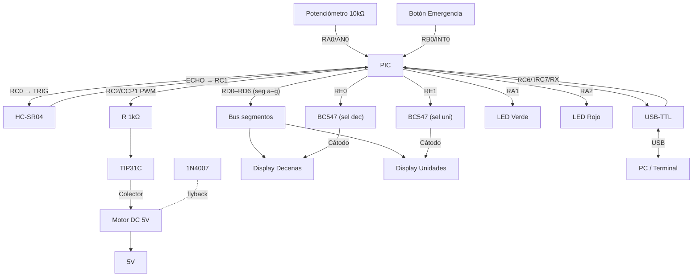
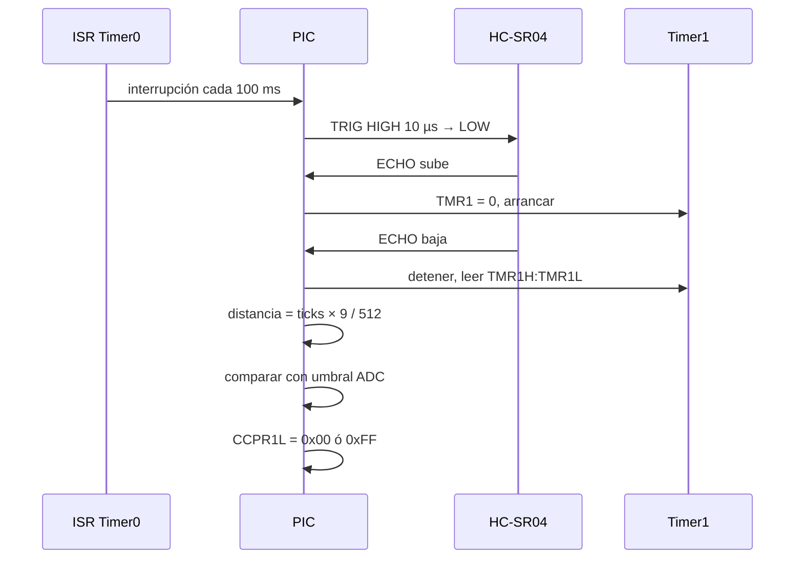

# Sierra Segura — PIC16F887
Electrónica Digital II - Universidad Nacional de Córdoba 
- Integrantes: Piren Amancay Rios Painefil / Juan Cruz Sanchez Oliveto / Ariana Agostina Sureda
- Profesor: Marcos Blasco

---
## 1. Descripción general del proyecto

El sistema mide continuamente la distancia entre la mano del operario y la hoja de sierra usando un HC-SR04. Si la distancia detectada es menor que un umbral de seguridad configurable, el sistema detiene automáticamente el motor para reducir el riesgo de accidentes.Además, dispone de un botón de emergencia que permite detener el motor de forma inmediata.Este proyecto busca aumentar la seguridad durante la operación de máquinas con elementos de corte. Está orientado al desarrollo de prototipos que requieran implementar sistemas básicos de seguridad y control utilizando microcontroladores.

### Alcances del proyecto

El sistema es capaz de:
- Medir la distancia entre la mano del operario y la zona de corte.
- Permitir la configuración de un umbral de seguridad utilizando un potenciómetro.
- Visualizar el valor del umbral configurado en dos displays de 7 segmentos.
- Detener el motor de forma inmediata mediante un boton.
- Comunicar el estado del sistema a una PC a través de UART.

El sistema no incluye:
- Control de una sierra industrial real.
- Registro histórico de eventos.

### Posibles etapas siguientes 
- Incluir un sistema de alarmas sonoras previas a la detención del motor para mejorar la seguridad del operario.
- Implementar rampas de aceleración y desaceleración del motor para evitar arranques bruscos.
- Mejorar UART enviando mensajes estructurados.

---
## 2. Arquitectura del sistema: Hardware y Software

### Hardware & Interconexión


### Arquitectura de software


---
## 3. Especificaciones eléctricas, alimentación y entorno

### Parámetros de alimentación y consumo 
- Tensión de operación del sistema: 5 V.
- Método de alimentación: Fuente de alimentación de 5 V.
- Consumo estimado en modo activo: Aprox. de 200 a 250 mA

### Entorno
- Herramientas de software: MPLAB X IDE y ensamblador MPASM.
- Método de programación: UART.
- Configuración de bits: 
   * PWRTE: ON
   * MCLRE: ON
   * BOREN: ON
   * WDT: OFF
   * FOSC HS (oscilador ext): 
   
- Periféricos internos utilizados: ADC / CCP1 / TIMER0 / TIMER1 / TIMER2 / EUSART / PWM
- Gestión de interrupciones: El sistema utiliza el único vector de interrupción disponible en el PIC16F887. La interrupción externa INT0 asociada al botón de emergencia tiene prioridad, ya que representa la condición más crítica del sistema. Ante su activación, el motor se detiene inmediatamente para garantizar la seguridad del operario.

---
## 4. Proceso de integración y desarrollo 

- Etapa 1 (validacion inicial): Se realizó la verificación de los puertos del microcontrolador que se iban a utilizar en el proyecto y se configuraron.
- Etapa 2 (adquisición/comunicación): Se implementó la lectura del ADC para obtener el valor del potenciómetro que se usa como umbral de seguridad.También se agregó la comunicación UART para poder enviar datos a la PC y facilitar la depuración del sistema. Además, en esta etapa también se comenzaron a revisar y diseñar las rutinas de servicio de interrupción necesarias para el funcionamiento del sistema.
- Etapa 3 (integración lógica): Se desarrolló la lógica principal del sistema, comparando la distancia medida por el HC-SR04 con el umbral configurado. Además, se implementó el control del motor mediante PWM y el uso de la interrupción externa para el botón de emergencia.
- Etapa 4 (sistema completo):


---
## 5. Ensayos, pruebas y resultados 
### Testeo del funcionamiento del sensor 


---
## 6. Estructura del repositorio

| Componente | Cantidad | Notas |
|------------|----------|-------|
| PIC16F887 | 1 | DIP-40 |
| Cristal 4 MHz | 1 | + capacitores 22 pF |
| HC-SR04 | 1 | Sensor ultrasónico |
| Potenciómetro 10 kΩ | 1 | Ajuste de umbral |
| Motor DC 5V | 1 | Simulación de sierra |
| Transistor TIP31C (o TIP120) | 1 | Driver PWM del motor |
| Diodo 1N4007 | 1 | Flyback del motor |
| Resistencia 1 kΩ | 1 | Base del transistor driver |
| Transistor BC547 | 2 | Selectores displays |
| Display 7 segmentos cátodo común | 2 | Dígito decenas y unidades |
| Resistencias 330 Ω | 7 | Una por segmento |
| Resistencias 1 kΩ | 2 | Base transistores selectores |
| LED verde | 1 | Estado operación |
| LED rojo | 1 | Estado alarma/emergencia |
| Resistencias 470 Ω | 2 | LEDs |
| Pulsador NO | 1 | Botón emergencia |
| Adaptador USB-TTL | 1 | Comunicación serie con PC |

---

## Asignación de pines

| Pin | Dir | Función |
|-----|-----|---------|
| RA0/AN0 | IN | Potenciómetro (ADC) |
| RA1 | OUT | LED verde |
| RA2 | OUT | LED rojo |
| RB0/INT0 | IN | Botón emergencia |
| RC0 | OUT | TRIG HC-SR04 |
| RC1 | IN | ECHO HC-SR04 |
| RC2/CCP1 | OUT | PWM → base transistor motor |
| RC6/TX | OUT | UART → PC |
| RC7/RX | IN | UART ← PC |
| RD0–RD6 | OUT | Segmentos a–g (bus compartido) |
| RE0 | OUT | Selector dígito decenas |
| RE1 | OUT | Selector dígito unidades |

---

## Diagrama de conexión



---

## Arquitectura del software

El programa principal solo inicializa periféricos y espera en un loop. Toda la lógica corre en interrupciones.

```
main
├── init()          ; config puertos, ADC, UART, PWM, timers, INT0
├── pwm_set(0)      ; motor apagado por defecto
└── loop
      └── tx_uart() si FLAG_TX activo

ISR
├── INT0  → emergencia: PWM=0, FLAG_EMERGENCY
└── TMR0  → cada 10 ms:
      ├── rutina_display()     ; alternar dígito activo
      └── cada 10 ciclos (100 ms):
            ├── leer_adc()     ; actualizar umbral
            ├── medir_hcsr04() ; polling ECHO con Timer1
            ├── comparar_distancia_umbral()
            │     ├── distancia < umbral → PWM=0, LED rojo
            │     └── distancia ≥ umbral → PWM=255, LED verde
            └── FLAG_TX = 1
```

---

## PWM con CCP1

El módulo CCP1 del PIC16F887 genera PWM por hardware en RC2. Se usa Timer2 como base de tiempo.

**Frecuencia de PWM:**
```
F_pwm = Fosc / (4 * prescaler * (PR2 + 1))
      = 4_000_000 / (4 * 1 * 256) ≈ 3.9 kHz   (PR2=0xFF, prescaler=1)
```

Suficiente para un motor DC pequeño sin ruido audible molesto.

**Duty cycle:**
- Motor ON → `CCPR1L = 0xFF` (100%)
- Motor OFF → `CCPR1L = 0x00` (0%)

No se usa velocidad variable en este TP; el PWM actúa como switch por software, pero deja la infraestructura lista para agregar control de velocidad.

```asm
; --- Configuración PWM (CCP1 en RC2) ---
BANKSEL PR2
MOVLW   0xFF
MOVWF   PR2             ; periodo máximo

BANKSEL T2CON
MOVLW   0x04            ; Timer2 ON, prescaler 1:1
MOVWF   T2CON

BANKSEL CCP1CON
MOVLW   0x0C            ; modo PWM
MOVWF   CCP1CON

BANKSEL CCPR1L
MOVLW   0x00            ; duty = 0% (motor apagado)
MOVWF   CCPR1L

; Motor ON:  MOVLW 0xFF → MOVWF CCPR1L
; Motor OFF: MOVLW 0x00 → MOVWF CCPR1L
```

---

## Flujo de medición HC-SR04



---

## Configuración de registros

```asm
; --- ADC ---
BANKSEL ADCON1
MOVLW   0x80        ; Vref=VDD, justificado derecha
MOVWF   ADCON1
BANKSEL ADCON0
MOVLW   0x01        ; Canal AN0, ADC ON
MOVWF   ADCON0

; --- Timer0: ~10 ms a 4 MHz ---
BANKSEL OPTION_REG
MOVLW   0x05        ; prescaler 1:64
MOVWF   OPTION_REG

; --- Timer1: medición ECHO ---
BANKSEL T1CON
MOVLW   0x01        ; Timer1 ON, prescaler 1:1 → 1 tick = 1 µs
MOVWF   T1CON

; --- Timer2 + CCP1: PWM ---
; (ver sección PWM arriba)

; --- UART: 9600 bps, 8N1, BRGH=1 ---
BANKSEL TXSTA
MOVLW   0x24
MOVWF   TXSTA
BANKSEL RCSTA
MOVLW   0x90
MOVWF   RCSTA
BANKSEL SPBRG
MOVLW   0x19        ; SPBRG=25 → 9600 bps exactos a 4 MHz
MOVWF   SPBRG

; --- Interrupciones ---
MOVLW   0xB0        ; GIE=1, TMR0IE=1, INTE=1
MOVWF   INTCON
BCF     OPTION_REG, INTEDG  ; INT0 por flanco descendente
```

---

## Tabla de registros clave

| Registro | Valor | Descripción |
|----------|-------|-------------|
| ADCON0 | `0x01` | Canal AN0, ADC ON |
| ADCON1 | `0x80` | Justificado a derecha, Vref=VDD |
| OPTION_REG | `0x05` | Timer0, prescaler 1:64 (~10 ms) |
| T1CON | `0x01` | Timer1 ON, prescaler 1:1 |
| T2CON | `0x04` | Timer2 ON, prescaler 1:1 |
| PR2 | `0xFF` | Periodo PWM |
| CCP1CON | `0x0C` | Modo PWM |
| CCPR1L | `0x00` / `0xFF` | Duty cycle motor OFF / ON |
| TXSTA | `0x24` | UART TX, async, BRGH=1 |
| RCSTA | `0x90` | UART RX, serial port ON |
| SPBRG | `0x19` | 9600 bps a 4 MHz |
| INTCON | `0xB0` | GIE=1, TMR0IE=1, INTE=1 |
| TRISC2 | `0` | RC2 como salida (CCP1/PWM) |
| TRISD | `0x00` | RD0–RD6 salidas segmentos |
| TRISE | `0x00` | RE0, RE1 salidas selectores display |

---

## Tabla lookup 7 segmentos

Orden `gfedcba`, cátodo común, activo en alto.

```asm
BCD_7SEG:
    ADDWF   PCL, F      ; W = dígito (0–9)
    RETLW   0x3F        ; 0
    RETLW   0x06        ; 1
    RETLW   0x5B        ; 2
    RETLW   0x4F        ; 3
    RETLW   0x66        ; 4
    RETLW   0x6D        ; 5
    RETLW   0x7D        ; 6
    RETLW   0x07        ; 7
    RETLW   0x7F        ; 8
    RETLW   0x6F        ; 9
```

---

## Rutina de multiplexado

```asm
RUTINA_DISPLAY:
    BCF     PORTE, RE0          ; apagar ambos (anti-ghosting)
    BCF     PORTE, RE1
    BTFSS   DISP_SEL, 0
    GOTO    SHOW_DEC
SHOW_UNI:
    MOVF    UMBRAL_UNI, W
    CALL    BCD_7SEG
    MOVWF   PORTD
    BSF     PORTE, RE1
    BSF     DISP_SEL, 0
    RETURN
SHOW_DEC:
    MOVF    UMBRAL_DEC, W
    CALL    BCD_7SEG
    MOVWF   PORTD
    BSF     PORTE, RE0
    BCF     DISP_SEL, 0
    RETURN
```

---

## Protocolo UART

**TX (PIC → PC)** cada 100 ms:
```
D:12cm U:08cm M:ON\r\n
D:05cm U:08cm M:OFF\r\n
```

**RX (PC → PIC):**
| Comando | Acción |
|---------|--------|
| `R` | Reanuda motor (si no hay obstrucción activa) |
| `P` | Para el motor, activa FLAG_EMERGENCY |

Configuración terminal: **9600 8N1**, sin control de flujo.

---

## Variables RAM (Bank 0)

| Nombre | Descripción |
|--------|-------------|
| `DIST_CM` | Distancia medida en cm |
| `UMBRAL_CM` | Umbral de corte en cm |
| `UMBRAL_DEC` | Dígito decenas del umbral |
| `UMBRAL_UNI` | Dígito unidades del umbral |
| `DISP_SEL` | Flag selector display (bit0) |
| `CICLO_CNT` | Contador de ciclos Timer0 (0–9) |
| `FLAGS` | Byte de flags del sistema |

**Mapa de FLAGS:**
```
bit 0 = FLAG_TX        ; enviar trama UART
bit 1 = FLAG_EMERGENCY ; paro de emergencia activo
bit 2 = FLAG_MOTOR     ; estado actual del motor
```

---

## Notas de implementación

- **Ghosting en displays:** siempre apagar ambos selectores antes de cambiar el bus de segmentos.
- **Flyback motor:** el diodo 1N4007 en paralelo con el motor (cátodo al positivo) es obligatorio.
- **ECHO del HC-SR04:** si no sube en ~1 ms post-TRIG, abortar y poner motor OFF por seguridad.
- **Cambio de banco en ISR:** guardar y restaurar `STATUS` y `W` al entrar/salir.
- **Tabla BCD_7SEG:** debe estar dentro de la misma página de 256 palabras (cuidado con desborde de PCL).
- **Config bits:** `_FOSC_HS`, `_WDTE_OFF`, `_PWRTE_ON`, `_MCLRE_ON`, `_LVP_OFF`.
- **RC2 como CCP1:** asegurarse de configurar `TRISC2 = 0` antes de habilitar el módulo CCP.
